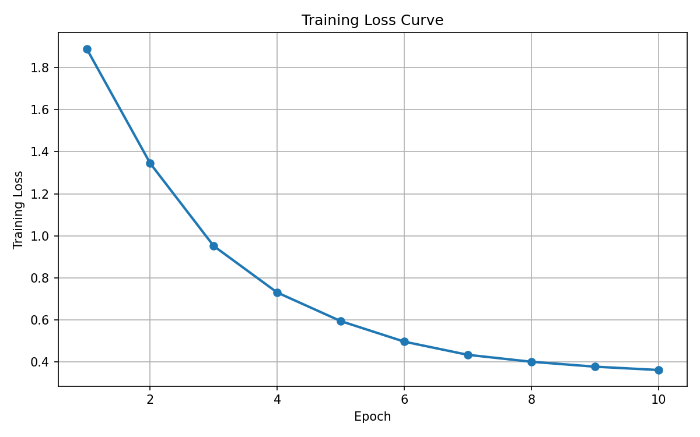
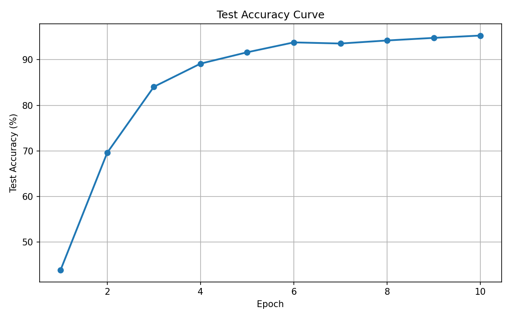
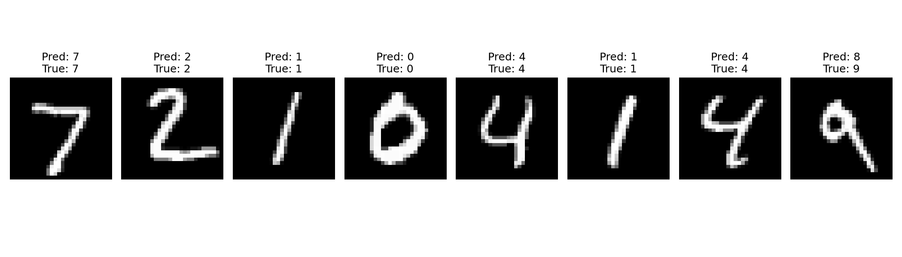

# MNIST Transformer from Scratch with PyTorch

基于 PyTorch 手动实现 Transformer 网络结构，并完成 MNIST 手写数字识别任务。

本项目采用简化版 Vision Transformer（ViT）思路：将 28 × 28 的灰度图像划分为多个图像块（Patch），把每个 Patch 转换为一个 Token，再通过自定义 Transformer Encoder 提取特征，最终完成 0–9 共 10 个类别的分类。

项目没有调用 PyTorch 官方提供的 `nn.Transformer`、`nn.TransformerEncoder`、`nn.TransformerEncoderLayer` 或 `nn.MultiheadAttention`，而是继承 `nn.Module` 手动实现了 Transformer 的核心结构。

---

## 1. 实验结果

模型训练 10 个 Epoch 后，最佳测试集准确率达到：

```text
95.31%
```

已经满足测试准确率达到 95% 以上的实验要求。

最后一个 Epoch 的结果如下：

| 指标                 |      数值 |
| ------------------ | ------: |
| Epoch              | 10 / 10 |
| Training Loss      |  0.3611 |
| Training Accuracy  |  88.19% |
| Test Loss          |  0.1568 |
| Test Accuracy      |  95.31% |
| Best Test Accuracy |  95.31% |

终端输出示例：

```text
Epoch [10/10]
Train Loss: 0.3611 | Train Acc: 88.19% | Test Loss: 0.1568 | Test Acc: 95.31%
Best model saved. Best Test Acc: 95.31%

============================================================
Training finished. Best Test Accuracy: 95.31%
============================================================
Requirement satisfied: accuracy is above 95%.
```
---

## 2. 项目特点

* 使用 PyTorch 完成 MNIST 手写数字分类。
* 使用 `torchvision.datasets.MNIST` 简化数据读取流程。
* 手动实现 Patch Embedding。
* 手动实现多头自注意力机制（Multi-Head Self-Attention）。
* 手动实现 Transformer Encoder Block。
* 使用可学习的 CLS Token 和 Position Embedding。
* 支持 NVIDIA GPU 和 CUDA 加速训练。
* 使用数据增强提高模型泛化能力。
* 自动保存测试准确率最高的模型参数。
* 自动记录每个 Epoch 的训练与测试指标。
* 自动绘制训练损失曲线。
* 自动绘制测试准确率曲线。
* 自动生成部分测试图片的预测结果可视化。

---

## 3. 项目结构
```text
mnist-transformer-pytorch/
│
├── mnist_transformer_vit.py       # 模型、训练、评估和可视化代码
├── README.md                      # 项目说明文档
├── requirements.txt               # Python 依赖列表
├── .gitignore                     # Git 忽略规则
│
├── training_result.png            # 终端训练结果截图
├── training_loss_curve.png        # 训练损失曲线
├── test_accuracy_curve.png        # 测试准确率曲线
└── mnist_predictions.png          # 部分测试图片的预测结果
```

程序运行后还会生成：

```text
best_mnist_transformer.pth
data/
```

其中：

* `best_mnist_transformer.pth` 是准确率最高的模型参数。
* `data/` 是 MNIST 数据集目录。

---

## 4. 可视化结果

### 4.1 训练损失曲线

程序会记录每个 Epoch 的 Training Loss，并生成：

```text
training_loss_curve.png
```



随着训练进行，损失值通常会逐渐下降。损失越低，说明模型的预测结果与真实标签之间的差距越小。

---

### 4.2 测试准确率曲线

程序会记录每个 Epoch 的 Test Accuracy，并生成：

```text
test_accuracy_curve.png
```



测试准确率曲线可以帮助观察模型在未参与训练的数据上的表现。

---

### 4.3 手写数字预测结果

程序会从测试集中取出部分图片，并生成：

```text
mnist_predictions.png
```



图片上方会显示：

```text
Pred: 模型预测结果
True: 真实标签
```

例如：

```text
Pred: 7
True: 7
```

表示模型成功识别该手写数字。

---

## 5. 数据集介绍

本项目使用 MNIST 手写数字数据集。

MNIST 是深度学习入门中常用的图像分类数据集，包含数字 0–9 的灰度图片。

| 数据类型  |      数量 |
| ----- | ------: |
| 训练集图片 |  60,000 |
| 测试集图片 |  10,000 |
| 图片尺寸  | 28 × 28 |
| 图片通道数 |       1 |
| 类别数量  |      10 |

类别如下：

```text
0, 1, 2, 3, 4, 5, 6, 7, 8, 9
```

程序使用 `torchvision` 自动下载并读取数据：

```python
train_dataset = datasets.MNIST(
    root="./data",
    train=True,
    transform=train_transform,
    download=True
)

test_dataset = datasets.MNIST(
    root="./data",
    train=False,
    transform=test_transform,
    download=True
)
```

首次运行时，如果本地没有 MNIST 数据集，程序会自动下载数据，并保存在：

```text
data/MNIST/
```

---

## 6. 模型整体流程

原始 MNIST 图片不能直接作为 Transformer 的 Token 序列，因此程序首先将图像切分为多个 Patch。

整体流程如下：

```text
MNIST Image
    ↓
Patch Embedding
    ↓
Patch Tokens
    ↓
Add CLS Token
    ↓
Add Position Embedding
    ↓
Custom Transformer Encoder Blocks
    ↓
Extract CLS Token Feature
    ↓
Linear Classification Head
    ↓
Predict Digit Category
```

---

## 7. 模型结构说明

### 7.1 输入图像

每张 MNIST 图片的形状为：

```text
[1, 28, 28]
```

其中：

* `1` 表示灰度图通道数。
* `28 × 28` 表示图像高度和宽度。

---

### 7.2 Patch Embedding

模型将每张图片切分为大小为 `4 × 4` 的 Patch。

由于：

```text
28 ÷ 4 = 7
```

因此一张图片会被划分为：

```text
7 × 7 = 49 个 Patch
```

每个 Patch 被映射为一个 96 维向量。

核心代码：

```python
self.proj = nn.Conv2d(
    in_channels=in_channels,
    out_channels=embed_dim,
    kernel_size=patch_size,
    stride=patch_size
)
```

张量形状变化如下：

```text
[B, 1, 28, 28]
        ↓
[B, 96, 7, 7]
        ↓
[B, 96, 49]
        ↓
[B, 49, 96]
```

其中：

* `B` 表示 Batch Size。
* `49` 表示 Patch 数量。
* `96` 表示每个 Token 的特征维度。

---

### 7.3 CLS Token

为了完成整张图片的分类，模型加入了一个可学习的分类 Token：

```python
self.cls_token = nn.Parameter(torch.zeros(1, 1, embed_dim))
```

加入 CLS Token 后：

```text
[B, 49, 96]
        ↓
[B, 50, 96]
```

经过 Transformer Encoder 后，模型取第一个 Token，也就是 CLS Token 对应的特征进行最终分类。

---

### 7.4 Position Embedding

Transformer 本身不能直接判断每个 Patch 在原图中的位置，因此需要加入位置编码：

```python
self.pos_embed = nn.Parameter(
    torch.zeros(1, num_patches + 1, embed_dim)
)
```

位置编码能够帮助模型区分图片的左上角、中心区域、右下角等不同位置。

---

### 7.5 多头自注意力机制

本项目没有调用：

```python
nn.MultiheadAttention
```

而是手动实现多头自注意力机制。

核心公式为：

```text
Attention(Q, K, V) = Softmax(QKᵀ / √d) V
```

其中：

* `Q`：Query，查询向量。
* `K`：Key，键向量。
* `V`：Value，值向量。
* `d`：每个注意力头的特征维度。

本项目设置：

```text
Embedding Dimension = 96
Number of Heads = 4
Head Dimension = 96 ÷ 4 = 24
```

通过多个注意力头，模型可以从不同角度学习各个 Patch 之间的关系。

---

### 7.6 Transformer Encoder Block

每个 Transformer Encoder Block 包含：

```text
LayerNorm
    ↓
Multi-Head Self-Attention
    ↓
Residual Connection
    ↓
LayerNorm
    ↓
MLP
    ↓
Residual Connection
```

核心代码：

```python
def forward(self, x):
    x = x + self.attn(self.norm1(x))
    x = x + self.mlp(self.norm2(x))
    return x
```

模型共使用 4 个 Transformer Encoder Block：

```python
depth = 4
```

---

### 7.7 分类头

经过 Transformer Encoder 后，程序取 CLS Token 对应的特征：

```python
cls_out = x[:, 0]
```

然后通过线性层输出 10 个类别的分数：

```python
self.head = nn.Linear(embed_dim, num_classes)
```

张量形状变化：

```text
[B, 50, 96]
        ↓
[B, 96]
        ↓
[B, 10]
```

最后选择分数最高的类别作为预测结果：

```python
preds = logits.argmax(dim=1)
```

---

## 8. 张量形状变化总结

假设：

```text
Batch Size = 128
```

则主要张量形状如下：

| 阶段                      | 张量形状               |
| ----------------------- | ------------------ |
| 原始输入图片                  | `[128, 1, 28, 28]` |
| Patch Embedding 卷积后     | `[128, 96, 7, 7]`  |
| 展平后                     | `[128, 96, 49]`    |
| 转置后                     | `[128, 49, 96]`    |
| 加入 CLS Token 后          | `[128, 50, 96]`    |
| 加入 Position Embedding 后 | `[128, 50, 96]`    |
| Q、K、V                   | `[128, 4, 50, 24]` |
| Attention Weights       | `[128, 4, 50, 50]` |
| Encoder 输出              | `[128, 50, 96]`    |
| 提取 CLS Token 后          | `[128, 96]`        |
| 分类头输出                   | `[128, 10]`        |

---

## 9. 数据预处理与增强

训练集使用以下预处理：

```python
train_transform = transforms.Compose([
    transforms.RandomAffine(
        degrees=10,
        translate=(0.08, 0.08),
        scale=(0.95, 1.05)
    ),
    transforms.ToTensor(),
    transforms.Normalize((0.1307,), (0.3081,))
])
```

其中：

* `RandomAffine`：随机旋转、平移和缩放图片。
* `ToTensor`：将图片转换为 PyTorch 张量。
* `Normalize`：对图片进行标准化。

测试集不需要随机增强：

```python
test_transform = transforms.Compose([
    transforms.ToTensor(),
    transforms.Normalize((0.1307,), (0.3081,))
])
```

### 为什么 Training Accuracy 低于 Test Accuracy？

本次实验结果中：

```text
Training Accuracy = 88.19%
Test Accuracy = 95.31%
```

原因是训练阶段使用了随机数据增强：

```python
transforms.RandomAffine(...)
```

训练图片会被随机旋转、平移和缩放，因此识别难度更高。

此外，训练阶段 Dropout 会启用，而测试阶段执行：

```python
model.eval()
```

Dropout 会关闭。因此测试阶段的图片更稳定，准确率可能高于训练阶段。

---

## 10. 训练参数

默认参数如下：

| 参数              |     数值 | 说明                           |
| --------------- | -----: | ---------------------------- |
| `batch_size`    |    128 | 每次训练读取的图片数量                  |
| `epochs`        |     10 | 完整训练集训练次数                    |
| `learning_rate` | 0.0003 | 学习率                          |
| `weight_decay`  | 0.0001 | 权重衰减                         |
| `patch_size`    |      4 | 每个 Patch 的边长                 |
| `embed_dim`     |     96 | 每个 Token 的特征维度               |
| `depth`         |      4 | Transformer Encoder Block 数量 |
| `num_heads`     |      4 | 注意力头数量                       |
| `mlp_ratio`     |    4.0 | MLP 隐藏层扩展比例                  |
| `dropout`       |    0.1 | Dropout 概率                   |

如果显存不足，可以将：

```python
batch_size = 128
```

修改为：

```python
batch_size = 64
```

或者：

```python
batch_size = 32
```

---

## 11. 环境配置

### 11.1 创建 Conda 虚拟环境

```bash
conda create -n mnist_transformer python=3.10 -y
conda activate mnist_transformer
```

### 11.2 安装依赖

先升级 pip：

```bash
python -m pip install --upgrade pip
```

如果使用支持 CUDA 12.6 的 NVIDIA 显卡环境，可以安装 CUDA 版本的 PyTorch：

```bash
python -m pip install torch torchvision torchaudio --index-url https://download.pytorch.org/whl/cu126
```

安装其他依赖：

```bash
python -m pip install matplotlib tqdm
```

也可以通过 `requirements.txt` 安装常规依赖：

```bash
python -m pip install -r requirements.txt
```

### 11.3 验证 GPU 是否可用

```bash
python -c "import torch; print(torch.__version__); print(torch.cuda.is_available()); print(torch.cuda.get_device_name(0) if torch.cuda.is_available() else 'CUDA not available')"
```

如果输出中包含：

```text
True
```

说明 PyTorch 已经能够使用 GPU。

---

## 12. 程序输出文件

运行完成后，程序会生成以下文件：

| 文件名                          | 作用             |
| ---------------------------- | -------------- |
| `best_mnist_transformer.pth` | 保存测试准确率最高的模型参数 |
| `training_loss_curve.png`    | 保存训练损失曲线       |
| `test_accuracy_curve.png`    | 保存测试准确率曲线      |
| `mnist_predictions.png`      | 保存部分测试样本预测结果   |

---

## 13. 核心代码限制说明

项目没有调用以下官方模块：

```python
nn.Transformer
nn.TransformerEncoder
nn.TransformerEncoderLayer
nn.MultiheadAttention
```

项目手动实现了：

```python
class PatchEmbedding(nn.Module)
class MultiHeadSelfAttention(nn.Module)
class TransformerEncoderBlock(nn.Module)
class MNISTVisionTransformer(nn.Module)
```

每个自定义模块均继承 `nn.Module`，并实现了 `__init__()` 和 `forward()` 方法。

---

## 15. 主要依赖

```text
Python
PyTorch
Torchvision
Matplotlib
tqdm
Anaconda
CUDA
MNIST Dataset
```

---

## 16. 后续改进方向

后续可以尝试：

* 绘制训练准确率曲线。
* 绘制测试损失曲线。
* 增加混淆矩阵。
* 输出模型参数数量。
* 添加单张图片推理功能。
* 将训练参数改为命令行参数。
* 将模型定义、训练代码和推理代码拆分为不同文件。
* 对比 CNN 和 Transformer 在 MNIST 数据集上的表现。

---

## 17. License

本项目仅用于学习、实验和课程作业。
